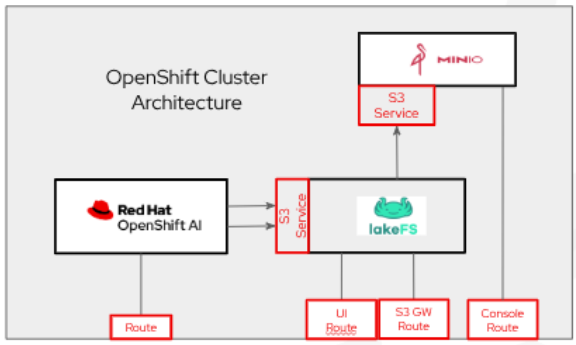

# Data versioning for Fraud Detectin with lakeFS

Fraud detection is a critical part of any business. Discover how data management and versioning with lakeFS enables repeatable, version-controlled data sets, using familiar workflows and processes, while reducing storage costs for generative and predictive AI applications.

## Table of contents

- [Detailed description](#detailed-description)
  - [See it in action](#see-it-in-action)
  - [Architecture diagrams](#architecture-diagrams)
- [Requirements](#requirements)
  - [Minimum hardware requirements](#minimum-hardware-requirements)
  - [Minimum software requirements](#minimum-software-requirements)
  - [Required user permissions](#required-user-permissions)
- [Deploy](#deploy)
  - [Pre-requisites](#pre-requisites)
  - [Deployment steps](#deployment-steps)
  - [Access lakeFS UI](#access-lakefs-ui)
  - [Delete](#delete)
- [References](#references)
- [Technical details](#technical-details)
- [Tags](#tags)

## Detailed description

The purpose of this AI quickstart is to highlight the benefits of data versioning, provided by lakeFS, in an AI/ML environment. lakeFS allows the data engineer to manage the lifecycle of data using the same workflow a developer uses to manage source code, using git. This means that, like source code, data can be versioned, branched, merged and pulled from a git repository, although the data is actually stored in a backend object storage.

The quickstart will allow a demonstrator to quickly deploy both object storage, using MinIO, and lakeFS to serve as a git-like gateway that data engineers can interface with for data access. The following steps can be run very quickly:

1. Deploy Minio for on-premesis object storage, running on the local OpenShift cluster
2. Deploy an instance of lakeFS for git-like management of data and data versioning
3. Deploy fraud detection notebooks in OpenShift AI
4. Create and train a model using the notebooks and data
5. Serve the trained model
6. Perform fraud detection on sample transactions data
7. Update the training data and retrain the model using the new data version
8. Perform fraud detection on a new version of the sample transaction data
9. Show how OpenShift AI pipelines can be used to retrain and/or perform detection on new versions of training and sample data


### See it in action 

TODO: create an arcade?

### Architecture diagrams




## Requirements

This quickstart was developed and test on an OpenShift cluster with the following components and resources. This can be considered the minimum requirements.

### Minimum hardware requirements 

| Node Type           | Qty  | vCPU   | Memory (GB) |
| --------------------|------|-------|--------------|
| Control Plane       | 3    | 8     | 16           |
| Worker              | 3    | 8     | 16           |

> [!NOTE]
> A GPU is not required for this quickstart

### Minimum software requirements

This quickstart was tested with the following software versions:

| Software                           | Version  |
| ---------------------------------- |:---------|
| Red Hat OpenShift                  | 4.20.5   |
| Red Hat OpenShift Service Mesh     | 2.5.11-0 |
| Red Hat OpenShift Serverless       | 1.37.0   |
| Red Hat OpenShift AI               | 2.25     |
| helm                               | 3.17.1   |
| lakeFS                             | 1.73.0   |
| MinIO                              | TBD      |


### Required user permissions

The user performing this quickstart should have the ability to create a project in OpenShift and OpenShift AI. This requires the cluster role of `admin` (does not require `cluster-admin`)


## Deploy

The process is very simple. Just follow the steps below.

### Pre-requisites

The steps assume the following pre-requisite products and components are deployed and functional with required permissions on the cluster:

1. Red Hat OpenShift Container Platform
2. Red Hat OpenShift Service Mesh
3. Red Hat OpenShift Serverless
4. Red Hat OpenShift AI
5. User has `admin` permissions in the cluster

### Deployment Steps

1. Clone this repo
```
$ git clone https://github.com/rh-ai-quickstart/Fraud-Detection-data-versioning-with-lakeFS.git
```

2. cd to `deploy` directory
```
$ cd Fraud-Detection-data-versioning-with-lakeFS/deploy
```

3. Login to the OpenShift cluster:
```
$ oc login --token=<user_token> --server=https://api.<openshift_cluster_fqdn>:6443
```

4. Make sure `deploy.sh` is executable and run it, passing it the name of the project in which to install. It can be an existing or new project. In this example, it will deploy to the `lakefs` project.
```
$ chmod + deploy.sh
$ ./deploy.sh lakefs
```

### Access lakeFS UI

Use the route to access the lakeFS browser-base UI. 

1. Leave the username set to `admin`
2. Enter your email address (or a bogus email address)
3. Download the `access_key_id` and `secret_access_key` displayed on the new page, as they will not be accessible later on
4. Go back to the login page and log in using those credentials.

### Delete

The project the apps were installed in can be deleted, which will delete all of the resources in it, including deployments, secrets, pods, configmaps, etc.
```
oc delete project lakefs
```

## References 

* lakeFS documentation [v1.73](https://docs.lakefs.io/v1.73/)
* OpenShift AI documentatin [v2.25](https://docs.redhat.com/en/documentation/red_hat_openshift_ai_self-managed/2.25)
* OpenShift AI Fraud Detection [example](https://docs.redhat.com/en/documentation/red_hat_openshift_ai_self-managed/2.25/html/openshift_ai_tutorial_-_fraud_detection_example)

## Technical details

<!-- 

*Section is optional.* 

Here is your chance to share technical details. 

Welcome to add sections as needed. Keep additions as structured and consistent as possible.

-->

## Tags

* Product: OpenShift AI
* Partner: lakeFS
* Partner product: lakeFS
* Business challenge: Fraud detection
