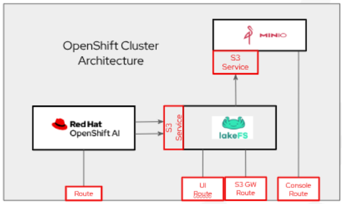

# Fraud Detection data versioning with lakeFS

<!-- TITLE: Fraud Detection data versioning with lakeFS -->

This AI quickstart demonstrates how to use **lakeFS as an AI data control plane** for Red Hat OpenShift AI using the fraud-detection tutorial workflow.

<!-- SHORT DESCRIPTION: Demonstrates lakeFS as an AI data control plane for OpenShift AI using a fraud-detection workflow with data versioning. -->

## Table of contents

- [Detailed description](#detailed-description)
  - [See it in action](#see-it-in-action)
  - [Architecture diagrams](#architecture-diagrams)
- [Requirements](#requirements)
  - [Minimum hardware requirements](#minimum-hardware-requirements)
  - [Minimum software requirements](#minimum-software-requirements)
  - [Required user permissions](#required-user-permissions)
- [Deploy](#deploy)
  - [Pre-requisites](#pre-requisites)
  - [Deployment steps](#deployment-steps)
  - [Access lakeFS UI](#access-lakefs-ui)
  - [Access Workflow Studio UI](#access-workflow-studio-ui)
  - [Monitor deployment](#monitor-deployment)
  - [Delete](#delete)
- [Documentation](#documentation)
- [References](#references)
- [Technical details](#technical-details)
- [Tags](#tags)

## Detailed description

The purpose of this AI quickstart is to highlight the benefits of data versioning, provided by lakeFS, in an AI/ML environment. lakeFS allows the data engineer to manage the lifecycle of data using the same workflow a developer uses to manage source code, using git. This means that, like source code, data can be versioned, branched, merged and pulled from a git repository, although the data is actually stored in a backend object storage.

### Data plane vs control plane

This quickstart intentionally separates responsibilities:

- **Data plane (object storage)**  
  MinIO / S3 stores the bytes: datasets, models, and pipeline artifacts.

- **Control plane (lakeFS)**  
  lakeFS adds Git-like semantics (branch, commit, merge, revert) and lineage metadata *on top of* the data in object storage.

- **Compatibility**  
  lakeFS exposes an **S3-compatible API**, so OpenShift AI and S3-native tools can use it as a drop-in endpoint without code changes.

After running this quickstart you can answer questions like:

- "Which exact dataset version trained the model that's currently served?"
- "What changed between the dataset used for model v1 and v2?"
- "Can we reproduce last month's metrics exactly?"
- "Can we roll back immediately if a bad data update ships?"

### What you'll do (and what lakeFS adds)

1. Deploy MinIO (object storage) and lakeFS (S3-compatible versioning gateway)
2. Configure OpenShift AI to use **lakeFS as its S3 endpoint** (data connection)
3. Use the **Fraud Detection Workflow Studio** (Streamlit UI) to:
   - validate your lakeFS and OpenShift AI environment
   - load training data from lakeFS and train a fraud model
   - save the model artifact back to lakeFS
   - register the model in OpenShift AI Model Registry
   - deploy the model to a KServe inference endpoint and run REST inference
4. Create a **lakeFS branch** for a data change (e.g., updated labels / new transactions)
5. Write updated training data to the branch, **commit** it, and retrain
6. Compare results across versions, then **merge** the branch to promote (or revert/discard)
7. (Optional) Run a pipeline or distributed training job that reads/writes through lakeFS so pipeline outputs are also versioned

### See it in action 

See a [demo](https://drive.google.com/file/d/1sQzVbMCIkM2JcT73FmzPLBbtInXs8oZk/view) of lakeFS with OpenShift AI, and the value they bring together.

### Architecture diagrams



## Requirements

This quickstart was developed and tested on an OpenShift cluster with the following components and resources. This can be considered the minimum requirements.


> [!NOTE]
> A GPU is not required for this quickstart

### Minimum software requirements

This quickstart was tested with the following software versions:

| Software                           | Version  |
| ---------------------------------- |:---------|
| Red Hat OpenShift                  | 4.20.5   |
| Red Hat OpenShift Service Mesh     | 2.5.11-0 |
| Red Hat OpenShift Serverless       | 1.37.0   |
| Red Hat OpenShift AI               | 2.25     |
| helm                               | 3.17.1   |
| lakeFS                             | 1.73.0   |
| MinIO                              | latest   |

### Required user permissions

The user performing this quickstart should have the ability to create a project in OpenShift and OpenShift AI. This requires the cluster role of `admin`.
| Chart | Required Role | Purpose |
|-------|--------------|---------|
| `fraud-detection-admin` | **cluster-admin** | Deploys Model Registry, PostgreSQL, patches DataScienceCluster, sets up RBAC |
| `fraud-detection` | **admin** (namespace-level) | Deploys lakeFS, MinIO, Workflow Studio UI, Data Science Pipeline Server |

> [!NOTE]
> If you only need the core lakeFS demo without Model Registry, you can skip the admin chart and run `make deploy` alone with namespace-level `admin` permissions.

## Deploy

The deployment uses Helm charts managed through a convenient Makefile interface.

### Pre-requisites

The steps assume the following pre-requisite products and components are deployed and functional with required permissions on the cluster:

1. Red Hat OpenShift Container Platform (or Kubernetes cluster)
2. Red Hat OpenShift Service Mesh
3. Red Hat OpenShift Serverless
4. Red Hat OpenShift AI
5. User has `admin` permissions in the cluster
6. Helm 3.x installed
7. `oc` (OpenShift) or `kubectl` (Kubernetes) CLI installed

### Deployment steps

**For Detailed Information see [Deployment ReadMe](/deploy/DEPLOY_README.md)**

1. Clone this repo

```bash
git clone https://github.com/rh-ai-quickstart/Fraud-Detection-data-versioning-with-lakeFS.git
```

2. cd to `deploy` directory

```bash
cd Fraud-Detection-data-versioning-with-lakeFS/deploy
```

3. Login to the OpenShift cluster:

```bash
oc login --token=<user_token> --server=https://api.<openshift_cluster_fqdn>:6443
```

4. Deploy using the Makefile (recommended):

The deployment uses two Helm charts. Install both for the full experience:
> [!NOTE]
> There are 2 ways to deploy based on your users permissions. If you have cluster admin access you can run anything in this repo. 
> If you only have user level access, you can have an admin run `make deploy-admin` and then as the user run `make deploy`.


```bash
# View all available commands and configuration
make help

# Option A: Deploy both charts at once (requires cluster-admin)
make deploy-all

# Option B: Deploy separately
# Step 1 - Admin chart: PostgreSQL + Model Registry + DSC patch (requires cluster-admin)
make deploy-admin

# Step 2 - User chart: lakeFS, MinIO, Workflow Studio UI, pipelines (namespace admin)
make deploy

# Check deployment status
make get-pods
```

The Makefile will automatically:
- Detect if you're on OpenShift or Kubernetes
- Create the namespace (`fraud-detection` by default)
- Deploy lakeFS, MinIO, the Workflow Studio UI, Model Registry (via the admin chart), and Data Science Pipeline Server
- Set up required RBAC and post-install configurations

**Customize deployment** (optional):

```bash
# Deploy to a custom namespace
make deploy NAMESPACE=my-lakefs-demo

# Use a longer timeout for slower clusters
make deploy TIMEOUT=15m
```

For detailed Makefile documentation, see [deploy/DEPLOY_README.md](deploy/DEPLOY_README.md).

### Access lakeFS UI

1. Get the lakeFS route or service URL:

```bash
# For OpenShift
make get-routes

# For Kubernetes
make get-services
```

2. Access the lakeFS browser-based UI using the route/URL:
   - Update the username set to `something`
   - Enter your email address (or a bogus email address)
   - Download the `access_key_id` and `secret_access_key` displayed on the new page, as they will not be accessible later on
    - Default value: `something` + `simple` | See values.yaml for actual values yours may differ. 
   - Go back to the login page and log in using those credentials

### Access Workflow Studio UI

The **Fraud Detection Workflow Studio** is a Streamlit application deployed with the user chart. It guides you through the end-to-end fraud-detection workflow on OpenShift AI.

1. Get the UI route URL:

```bash
# OpenShift (recommended)
make get-ui-route

# Or list all routes in the namespace
make get-routes
```

2. Open the URL in your browser. The UI walks through these stages:

| Stage | Description |
|-------|-------------|
| **0. Readiness** | Validate lakeFS, data connections, and OpenShift AI services |
| **1. Train** | Train the fraud model using data from lakeFS |
| **2. Save to lakeFS** | Upload the trained model artifact to lakeFS |
| **3. Register Model** | Register the model in OpenShift AI Model Registry |
| **4. Deploy Model** | Create a KServe InferenceService |
| **5. REST Inference** | Send inference requests and review fraud predictions |
| **8. Distributed** | Submit CodeFlare + Ray distributed training jobs |

3. Monitor the UI deployment:

```bash
make logs-ui
```

**Customize the UI image** (optional, for local development):

The deployed UI pulls a pre-built image from Quay. To build and publish your own changes:

```bash
# Log in to Quay (once)
make login-ui-quay

# Build, push, and restart the UI deployment
make publish-ui-image
```

Individual steps are also available: `make build-ui-image`, `make push-ui-image`.

### Monitor deployment

```bash
# View all resources
make get-all

# Check specific component logs
make logs-lakefs
make logs-minio
make logs-ui
```

### Delete

Remove the deployment using the Makefile:

```bash
# Undeploy the Helm release and delete the namespace
make undeploy

# Or delete everything including namespace
make clean-all
```

Alternatively, you can manually delete the project/namespace:

```bash
oc delete namespace fraud-detection
# or
kubectl delete namespace fraud-detection
```

## Documentation

For detailed guides on specific topics, see:

| Guide | Description |
|-------|-------------|
| [Deployment Guide](deploy/DEPLOY_README.md) | Makefile commands, component details, and troubleshooting |
| [Pipelines Guide](docs/PIPELINES.md) | Comprehensive guide to Data Science Pipelines setup and usage |
| [Pipelines Quick Reference](demo/pipelines/PipelinesReadMe.md) | Quick reference for pipeline files |

## References

* lakeFS documentation [v1.73](https://docs.lakefs.io/v1.73/)
* OpenShift AI documentation [v2.25](https://docs.redhat.com/en/documentation/red_hat_openshift_ai_self-managed/2.25)
* OpenShift AI Fraud Detection [example](https://docs.redhat.com/en/documentation/red_hat_openshift_ai_self-managed/2.25/html/openshift_ai_tutorial_-_fraud_detection_example)
* OpenShift AI Pipelines [documentation](https://docs.redhat.com/en/documentation/red_hat_openshift_ai_self-managed/2.25/html/working_with_data_science_pipelines)

## Technical details

lakeFS exposes an S3-compatible API. In S3 terms:

- **Bucket = lakeFS repository**
- **First path segment = branch**
- Object paths follow:

  s3://[REPOSITORY]/[BRANCH]/PATH/TO/OBJECT

Example:
- Training data:  s3://fraud/main/data/transactions.parquet
- Experiment data: s3://fraud/exp-01/data/transactions.parquet
- Model artifact:  s3://fraud/exp-01/models/fraud/1/model.onnx

In real AI platforms, the point isn't just versioning—it's controlled promotion:

- Protect `main` so changes only arrive via merges
- Add pre-merge hooks (Actions) to enforce data quality checks (schema, format, PII scanning)
- Merge = "publish" approved data/model artifacts to consumers

## Tags

<!-- 
Title: Fraud Detection data versioning with lakeFS
Description: Demonstrates lakeFS as an AI data control plane for OpenShift AI using a fraud-detection workflow.
Industry: Financial Services
Product: OpenShift AI
Use case: Data versioning, MLOps, Fraud detection
Contributor org: Red Hat
-->

* Product: OpenShift AI
* Partner: lakeFS
* Partner product: lakeFS
* Industry: Financial Services
* Use case: Data versioning, MLOps, Fraud detection
